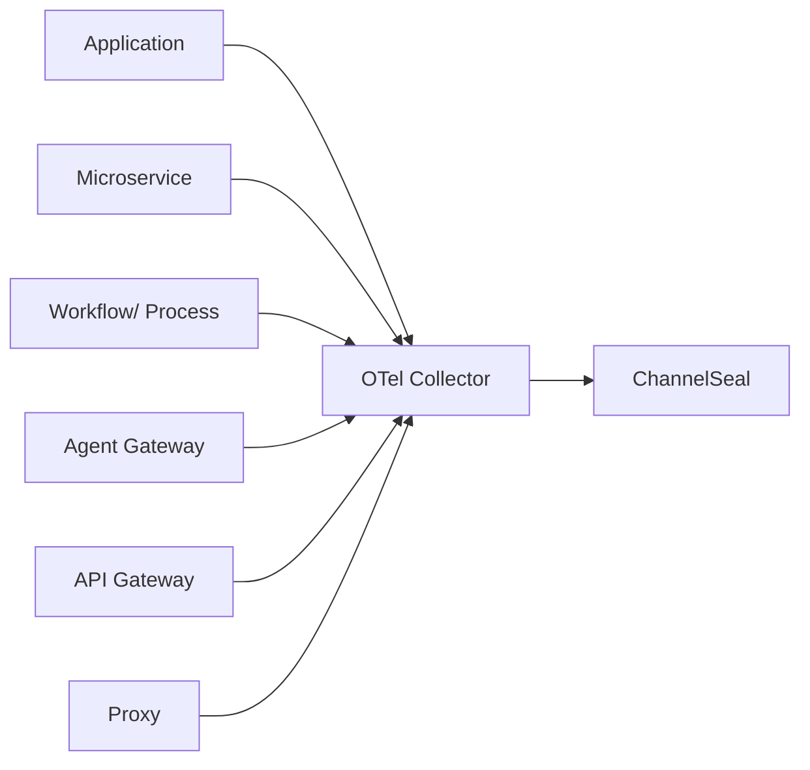
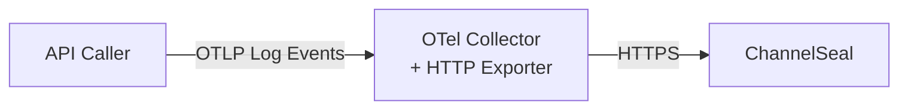
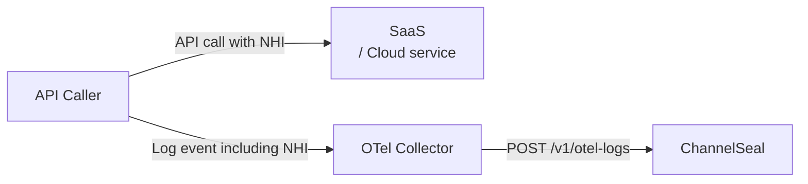

# Integration with OpenTelemetry Collector

[OpenTelemetry](https://opentelemetry.io/) (OTel), is a vendor-neutral open source Observability framework for instrumenting, generating, collecting, and exporting telemetry data such as traces, metrics, and logs. As an industry-standard, OpenTelemetry is supported by more than 90 observability vendors, integrated by many libraries, services, and apps, and adopted by numerous end users.


ChannelSeal can ingest log events of HTTP API traffic from applications, microservices and infrastructure including gateways, proxies, integration brokers, etc. in widely-recognized [OTLP log](https://opentelemetry.io/docs/specs/otel/logs/data-model/) format.




This document describes how to provide HTTP API traffic metadata to ChannelSeal using the OpenTelemetry Observability protocol and framework.

## Collector
OpenTelmetry [Collector](https://opentelemetry.io/docs/collector/) offers a vendor-agnostic implementation on how to receive, process and export telemetry data from microservices, shared infra and client instrumented code. It also removes the need to run, operate and maintain multiple agents/collectors in order to support open-source telemetry data formats (e.g. Jaeger, Prometheus, etc.) to multiple open-source or commercial back-ends.


#### OTLP HTTP Exporter

You can send HTTP API traffic log events in OTLP log format to ChannelSeal via an OTel Collector configured with an exporter [`otlphttpexporter`](https://github.com/open-telemetry/opentelemetry-collector/tree/main/exporter/otlphttpexporter).


This exporter forwards log events securely to ChannelSeal after required validation, filtering, transformation, etc. 

### Configuration

We have provided a [sample configuration](./otel-collector-config.yaml) for an OTel Collector that is configured with required protocol(s), security, encoding, and processing middleware. 

#### Exporter Configuration

**Endpoint**

Use the following endpoint of ChannelSeal to send log events.

```yaml
    logs_endpoint: "https://logs.channelseal.com/v1/otel-logs"
```
**Security**

**Organization Id**

ChannelSeal requires your Organization Id in exported OTEL Log Events. Use HTTP custom header `CS-Org-Id` to provide your organization id in the `exporter` configuration.

```yaml
    headers:
        CS-Org-Id: "10000000" #Replace with your ChannelSeal Organization Id
```

**Example**

```yaml

exporters:
    otlphttp:
        # Base endpoint; Collector will use /v1/otel-logs for logs
        #logs_endpoint: "https://logs.channelseal.com/v1/otel-logs" #external
        logs_endpoint: "http://host.docker.internal:8000/otel-http-export-logs" #internal use
        compression: none
        encoding: json
        timeout: 10s
        sending_queue:
            enabled: true
            queue_size: 8000
        retry_on_failure:
            enabled: true
            initial_interval: 5s
            max_interval: 30s
            max_elapsed_time: 300s
        tls:
            insecure: true #TODO: make it secure
        headers:
            CS-Org-Id: "10000000" #Replace with your ChannelSeal Organization Id
```

Follow instructions on [Collector Configuration](https://opentelemetry.io/docs/collector/configuration/) to change configuration as per your requirements.

## Start Container

```shell
# Start Collector
docker compose up -d
```

## Send Log Events

Send [sample events](./sample_otel_events.json) using curl.

```curl
curl -X POST \
  http://localhost:4318/v1/logs \
  -H "Content-Type: application/json" \
  --data @./sample_otel_events.json
```

## API Caller Identification

Integrations are between SaaS or Cloud Services and your applications, services, and automated processes consuming the APIs exposed by those services. In order to identify API callers from API traffic and relate these with sensitive data identified in ChannelSeal, the identity used by the caller is important to provide via log events. 

### Non-human Identity (NHI)

Non-Human Identities (NHIs) are digital credentials and authentication mechanisms used by machines, applications, services, and automated processes to securely access resources and communicate without human intervention.  They serve as unique "identities" for software, devices, APIs, and workloads, enabling machine-to-machine interactions that power modern IT, cloud, DevOps, and SaaS environments.

Each API message passing through an integration channel would have an NHI, such as an OAuth client id, api key, or even user name if BASIC auth is used for API authentication.




To relate sensitive data elements found in API traffic, send a log record with attribute named `http.request.header.X-Client-Id` with value of the NHI (no secrets). 

#### How to extract NHI?

Typically, NHI would be easily available at the source application, service or process where API is called from. NHI could also be retrieved with some instrumentation from an intermediary such as an egress gateway or forward proxy. If these calls are instrumented, NHIs would be available.

Following example of OTLP Log event shows how to pass this header as `logRecords.attributes`

```json
{
    "resourceLogs": [
        {
            "resource": {
                "attributes": [
                ]
            },
            "scopeLogs": [
                {
                    "scope": {
                        "name": "io.opentelemetry.contrib.http",
                        "version": "1.0.0"
                    },
                    "logRecords": [
                        {
                            "timeUnixNano": "1733662080123456789",
                            "observedTimeUnixNano": "1733662081123456789",
                            "severityText": "INFO",
                            "severityNumber": 9,
                            "body": {
                                "stringValue": "HTTP POST /clients/api/v4 -> 200"
                            },
                            "attributes": [
                                { "key": "http.url", "value": { "stringValue": "https://api.iban.com/clients/api/v4?api_key=9834hAHx78ba4g8habsdk&country=GB&format=json&bankcode=110377&account=10218962" }
                                },
                                { "key": "http.request.header.user-agent", "value": { "stringValue": "Mozilla/5.0" }
                                },
                                { "key": "http.request.header.content-type", "value": { "stringValue": "application/json"
                                } },
                                { "key": "http.request.header.X-Client-Id", "value": { "stringValue": "041ba848-096c-411d-af05-38f30a0ef42c" }
                                },
                                { "key": "http.response.header.content-length", "value": { "intValue": 1024 }
                                }
                            ]
                        }
                    ]
                }
            ]
        }
]
}
```
