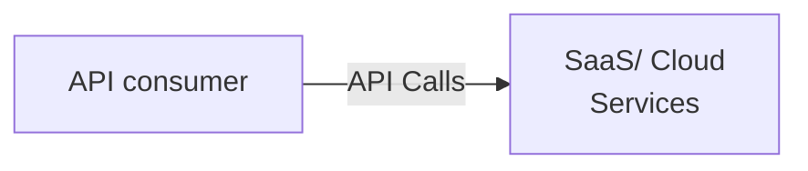
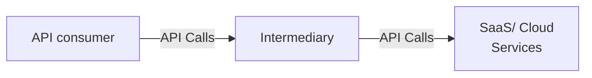
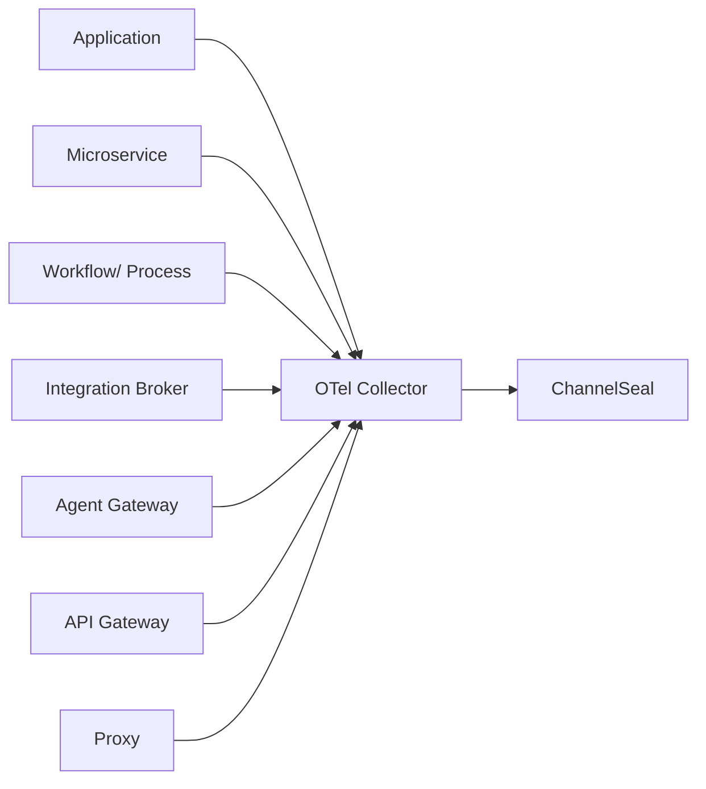
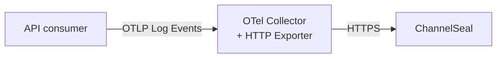
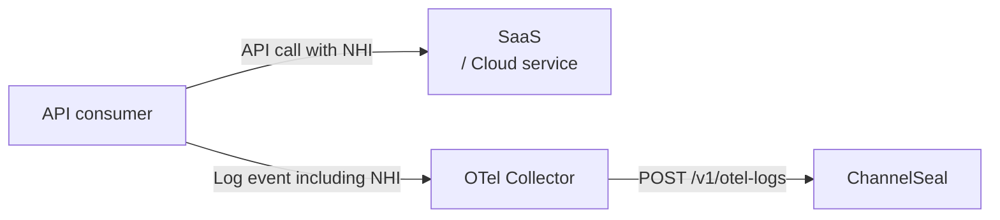

# Integration with OpenTelemetry Collector

[OpenTelemetry](https://opentelemetry.io/) (OTel), is a vendor-neutral open source Observability framework for instrumenting, generating, collecting, and exporting telemetry data such as traces, metrics, and logs. As an industry-standard, OpenTelemetry is supported by more than 90 observability vendors, integrated by many libraries, services, and apps, and adopted by numerous end users .


This document describes how to provide HTTP API traffic metadata to ChannelSeal using the OpenTelemetry observability protocol and framework.

## Signals

Signals are system outputs that describe the underlying activity of the operating system and applications running on a platform. A signal can be something you want to measure at a specific point in time, like an HTTP API call that goes through the components of your distributed system. You can group different signals together to observe the inner workings of the same piece of technology under different angles.

#### ChannelSeal

ChannelSeal currently supports the following OpenTelemetry signals:

* Logs
* Traces

### Logs

A [log](https://opentelemetry.io/docs/concepts/signals/logs/) is a timestamped text record, either structured (recommended) or unstructured, with optional metadata. Of all telemetry signals, logs have the biggest legacy. Most programming languages have built-in logging capabilities or well-known, widely used logging libraries.

OpenTelemetry is designed to work with the logs you already produce, offering tools to correlate logs with other signals, add contextual attributes, and normalize different sources into a common representation for processing and export.

#### Structured Logs

A [structured log](https://opentelemetry.io/docs/concepts/signals/logs/#structured-logs) is a log with a defined, consistent schema or typed fields that downstream systems can reliably parse and interpret.

#### ChannelSeal
ChannelSeal currently supports **JSON structured logs** as shown in [sample](https://opentelemetry.io/docs/concepts/signals/logs/#structured-logs).

### Traces

A distributed [trace](https://opentelemetry.io/docs/concepts/signals/traces/) is a set of events, triggered as a result of a single logical operation (e.g. HTTP API call), consolidated across various components of an application. A distributed trace contains events that cross process, network and security boundaries.  

#### Span

Traces in OpenTelemetry are defined implicitly by their Spans. In particular, a Trace can be thought of as a directed acyclic graph (DAG) of Spans, where the edges between Spans are defined as parent/child relationship.

A [span](https://opentelemetry.io/docs/concepts/signals/traces/#spans) represents a unit of work or operation. Spans track specific operations that a request makes, painting a picture of what happened during the time in which that operation was executed.

For example, the following is an example **Trace** made up of 6 **Spans**:

```
Temporal relationships between Spans in a single Trace

––|–––––––|–––––––|–––––––|–––––––|–––––––|–––––––|–––––––|–> time

 [Span A···················································]
   [Span B··········································]
      [Span D······································]
    [Span C····················································]
         [Span E·······]        [Span F··]
```


A span contains name, time-related data, structured log messages, and other metadata (that is, [Attributes](https://opentelemetry.io/docs/concepts/observability-primer/#span-attributes)) to provide information about the operation it tracks.

#### ChannelSeal

ChannelSeal recognizes trace events with [HTTP spans](https://opentelemetry.io/docs/specs/semconv/http/http-spans/). 

## Instrumentation

For a system to be observable, it must be instrumented: that is, code from the system’s components must emit signals, such as traces, metrics, and logs.

Integrations are between SaaS or Cloud Services and your applications, services, and automated processes that consume the APIs exposed by those services. 

### Direct Integration

In the diagram below, API consumer could be your application, microservice, workflow or process that consumes APIs offered by service provider(s) directly.



### Integration via intermediary

Most often, some sort of intermediary is involved in API consumption as shown below. An intermediary could be an API gateway, a proxy, an integration broker, an enterprise service bus, an integration platform (iPaaS), etc.



### Approaches for instrumentation

API consumer or intermediary can be instrumented in two primary ways:

1. [Code-based solutions](https://opentelemetry.io/docs/concepts/instrumentation/code-based/) via official [APIs and SDKs for most languages](https://opentelemetry.io/docs/languages/)
2. [Zero-code solutions](https://opentelemetry.io/docs/concepts/instrumentation/zero-code/)

Code-based solutions allows to get deeper insight and rich telemetry from your application itself. They let you use the OpenTelemetry API to generate telemetry from your application, which acts as an essential complement to the telemetry generated by zero-code solutions.

Zero-code solutions are great for getting started, or when you can’t modify the application you need to get telemetry out of. They provide rich telemetry from libraries you use and/or the environment your application runs in. Another way to think of it is that they provide information about what’s happening at the edges of your application.

OpenTelemetry provides a [Logs API and SDK](https://opentelemetry.io/docs/concepts/signals/logs/#language-support) for producing log records, and language SDKs and logging bridges to integrate with existing logging frameworks. Logs are anything you send through a Logging Provider, and events are a special type of logs. The Logs API is public and can be used directly by application code or indirectly via existing logging libraries and bridges.

The OpenTelemetry [Registry](https://opentelemetry.io/ecosystem/registry) provides extensive set of instrumentation libraries in the OpenTelemetry ecosystem.

## Collector
OpenTelmetry [Collector](https://opentelemetry.io/docs/collector/) offers a vendor-agnostic implementation on how to receive, process and export telemetry data from microservices, shared infra and client instrumented code. It also removes the need to run, operate and maintain multiple agents/collectors in order to support open-source telemetry data formats (e.g. Jaeger, Prometheus, etc.) to multiple open-source or commercial back-ends.


ChannelSeal can ingest log or trace events of HTTP API traffic from API consumers and integration intermediaries.



### Receivers

Receivers collect telemetry data from various sources and formats. OTel Collector offers various [Receivers](https://opentelemetry.io/docs/collector/components/receiver/) to integrate enterprise systems.

### OTLP HTTP Exporter

You can send HTTP API traffic events in OTLP [log](https://opentelemetry.io/docs/specs/otel/logs/data-model/) or [trace](https://opentelemetry.io/docs/specs/semconv/http/http-spans/) format to ChannelSeal via an OTel Collector configured with an exporter [`otlphttpexporter`](https://github.com/open-telemetry/opentelemetry-collector/tree/main/exporter/otlphttpexporter). This exporter forwards the OTel events securely to ChannelSeal after required validation, filtering, transformation, etc. Events could be sent in batches and with compression.



### Configuration

We have provided a [sample configuration](otel-internal-collector-config.yaml) for an OTel Collector that is configured with required protocol(s), security, encoding, and processing middleware. This configuration would send OTel events (logs/traces) to ChannelSeal securely and in batches.

#### Exporter Configuration

Following section describes the configuration for OTLP HTTP Exporter.

**Endpoint**

Use the following endpoint of ChannelSeal to send OTel events.

```yaml
    endpoint: "https://logs.channelseal.com/v1/otel"
```

**Security**


Use `oauth2client` extension to authenticate to ChannelSeal OTel endpoint. This extension provides OAuth2 Client Credentials flow authenticator for HTTP exporter. The extension fetches and refreshes the token after expiry automatically.

*Extension*

```
  extensions:
    oauth2client:
      client_id: someclientid  # <-- Your client id
      client_secret: <secret>       # <-- Your client secret
      token_url: https://dev-channelseal.us.auth0.com/oauth/token
      endpoint_params:
        audience: https://api.channelseal.com
        grant_type: client_credentials
      
  service:    
    extensions: [health_check, oauth2client]
```

*Extension*

```yaml
exporters:
  otlphttp:
    endpoint: "https://logs.channelseal.com/v1/otel"
    auth:
      authenticator: oauth2client
    tls:
      insecure: false
      ca_file: /path/to/ca.pem # <-- ask for CA certs used by ChannelSeal
```

**Organization Id**

ChannelSeal requires your Organization Id in exported OTEL Log Events. Use HTTP custom header `CS-Org-Id` to provide your organization id in the `exporter` configuration.

```yaml
    headers:
        CS-Org-Id: "Your ChannelSeal Org Id" #Replace with your ChannelSeal Organization Id
```

**Example**

```yaml

exporters:
    otlphttp:
        # Base endpoint; Collector will use /v1/otel-logs for logs
        endpoint: "https://logs.channelseal.com/v1/otel"
        headers:
          CS-Org-Id: "Your ChannelSeal Org Id" #Replace with your ChannelSeal Organization Id
        tls:
            insecure: true #TBD secure
        timeout: 10s
        read_buffer_size: 123
        write_buffer_size: 345
        sending_queue:
            enabled: true
            num_consumers: 2
            queue_size: 10
        retry_on_failure:
            enabled: true
            initial_interval: 10s
            randomization_factor: 0.7
            multiplier: 1.3
            max_interval: 60s
            max_elapsed_time: 10m
        compression: gzip
        debug:
            verbosity: normal  # or detailed / basic

```

Follow instructions on [Collector Configuration](https://opentelemetry.io/docs/collector/configuration/) to change configuration as per your requirements. The OpenTelemetry [Registry](https://opentelemetry.io/ecosystem/registry) provides extensive set of collector components, utilities, and other useful projects in the OpenTelemetry ecosystem.

### Future
ChannelSeal would provide `processor` and `exporter` in future for seamless and quick integration to Collector.

## Start Container

```shell
# Start Collector
docker compose up -d
```

## Send Log Events

Send [sample log events](sample_otel_log_events.json) to Collector using curl.

```curl
curl -X POST \
  http://localhost:4318/v1/logs \
  -H "Content-Type: application/json" \
  --data @./sample_otel_log_events.json
```

Log in to ChannelSeal Portal and check Discovery->Channels to find if there are entries for `http.target` of events sent.

## Send Trace Events

Send [sample trace events](sample_otel_trace_events.json) to Collector using curl.

```curl
curl -X POST \
  http://localhost:4318/v1/traces \
  -H "Content-Type: application/json" \
  --data @./sample_otel_trace_events.json
```
Log in to ChannelSeal Portal and check Discovery->Channels to find if there are entries for `http.target` of events sent.

## Application Attribution

In order to identify API consumers from API traffic and relate these with sensitive data identified in ChannelSeal, the identity used by the consumer is important to provide via log events. 

### Non-human Identity (NHI)

Non-Human Identities (NHIs) are digital credentials and authentication mechanisms used by machines, applications, services, and automated processes to securely access resources and communicate without human intervention.  They serve as unique "identities" for software, devices, APIs, and workloads, enabling machine-to-machine interactions that power modern IT, cloud, DevOps, and SaaS environments.

Each API message passing through an integration channel would have an NHI, such as an OAuth client id, api key, or even user name if BASIC auth is used for API authentication.




To relate sensitive data elements found in API traffic, send a log record with attribute named `http.request.header.X-Client-Id` with value of the NHI (no secrets). 

#### How to extract NHI?

Typically, NHI would be easily available at the source application, service or process where API is called from. NHI could also be retrieved with some instrumentation from an intermediary such as an egress gateway or forward proxy. If these calls are instrumented, NHIs would be available.

Following example of OTLP Log event shows how to pass this header as `logRecords.attributes`

```json
{
    "resourceLogs": [
        {
            "resource": {
                "attributes": [
                ]
            },
            "scopeLogs": [
                {
                    "scope": {
                        "name": "io.opentelemetry.contrib.http",
                        "version": "1.0.0"
                    },
                    "logRecords": [
                        {
                            "timeUnixNano": "1733662080123456789",
                            "observedTimeUnixNano": "1733662081123456789",
                            "severityText": "INFO",
                            "severityNumber": 9,
                            "body": {
                                "stringValue": "HTTP POST /clients/api/v4 -> 200"
                            },
                            "attributes": [
                                { "key": "http.url", "value": { "stringValue": "https://api.iban.com/clients/api/v4?api_key=9834hAHx78ba4g8habsdk&country=GB&format=json&bankcode=110377&account=10218962" }
                                },
                                { "key": "http.request.header.user-agent", "value": { "stringValue": "Mozilla/5.0" }
                                },
                                { "key": "http.request.header.content-type", "value": { "stringValue": "application/json"
                                } },
                                { "key": "http.request.header.X-Client-Id", "value": { "stringValue": "041ba848-096c-411d-af05-38f30a0ef42c" }
                                },
                                { "key": "http.response.header.content-length", "value": { "intValue": 1024 }
                                }
                            ]
                        }
                    ]
                }
            ]
        }
]
}
```
